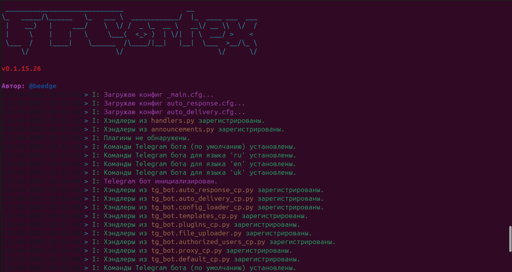
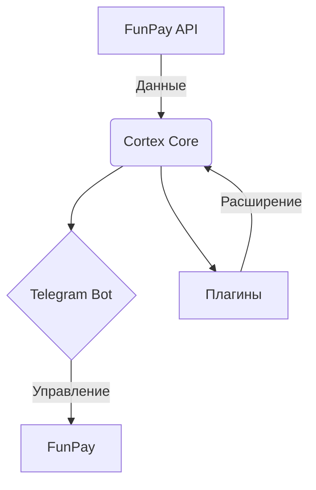

<!-- Open Graph / Twitter Card Meta -->
<meta property="og:title" content="FunPay Cortex — Авто-Бот для FunPay ☄️" />
<meta property="og:description" content="Мощный Telegram-бот для FunPay: автосдача, автоответы, автоподнятие, плагины. Экономьте время, управляйте онлайн. Установите и забудьте!" />
<meta property="og:image" content="https://i.imgur.com/mU4Jum5.png" />
<meta name="twitter:card" content="summary_large_image" />

<p align="center">
  
</p>

<p align="center">
  
</p>

<h1 align="center">
  <span style="color:#36CA5C"><b>FunPay Cortex</b></span>
</h1>

<p align="center">
  <b>🤖 Автоматизируй FunPay — управляй ботом через Telegram, расширяй плагинами и зарабатывай на автопилоте!</b>
</p>

<p align="center">
  <a href="https://t.me/FunPayCortex"></a>
  <a href="https://www.python.org/"></a>
  <a href="https://github.com/Beedgee/FunPayCortex/stargazers"></a>
  <a href="https://github.com/Beedgee/FunPayCortex/network"></a>
  <a href="https://opensource.org/licenses/MIT"></a>
</p>

---

<p align="center">
  
</p>

---

<details>
<summary><b>🧠 <span style="color:#36CA5C">Что такое FunPay Cortex?</span></b></summary>

> **FunPay Cortex** — это не просто бот. Это ультимативный мозг для вашей торговли на FunPay.  
> Автовыдача, автоподнятие лотов, автоответы, вечный онлайн, кастомные плагины и полный контроль в Telegram.  
>  
> Не тратьте время вручную — Cortex сделает всю рутину за вас.  
>  
> 
>
> <sub>— "Почему бы просто не автоматизировать весь бизнес?" — Cortex (почти)</sub>
</details>

---

## 🚩 Быстрые ссылки

| [Особенности](#-особенности) | [Установка](#-установка) | [Использование](#-использование) | [Демо](#-демо) | [Плагины](#-плагины) | [Поддержка](#-поддержка-и-связь) |

---

## ✨ Особенности

<details>
<summary><b>🧩 Модульность и API</b></summary>

- **Изолированная библиотека `FunPayAPI`** — ядро, которое можно использовать отдельно!
- **Плагины** — добавляйте кастомные функции за 5 минут.
- **Мультиязычность** — RU/EN/UA интерфейс.
</details>

<details>
<summary><b>📲 Управление через Telegram</b></summary>

- **Интерактивная панель** — забудьте про ручное редактирование файлов.
- **Мгновенные уведомления** — заказы, отзывы, сообщения.
- **Мульти-админ** — делегируйте управление безопасно.
</details>

<details>
<summary><b>⚡ Умная автоматизация</b></summary>

- **Автовыдача** — кастомная логика, мульти-выдача.
- **Автоподнятие лотов** — обходит лимиты FunPay.
- **Автоответчик** — макросы и авто-команды.
- **Вечный онлайн** — всегда на связи.
</details>

<details>
<summary><b>🛡️ Стабильность и поддержка</b></summary>

- **Proxy** — работает из любого места.
- **systemd сервис** — запуск как сервис.
- **Гибкое логирование** — полный контроль над логами.
- **Авто-обновления** — всегда актуальная версия.
</details>

---

## 🛠️ Технологии

| Язык | Библиотеки | ОС | Конфиг |
|:----:|:----------:|:--:|:------:|
|  | pyTelegramBotAPI, Requests, BeautifulSoup4, lxml, psutil, bcrypt |    | INI (.cfg) |

---

## 📦 Установка

<details>
<summary><b>🟦 Windows</b></summary>

1. <a href="https://www.python.org/ftp/python/3.11.0/python-3.11.0-amd64.exe"><b>Скачай Python 3.11+</b></a> и поставь галочку «Add python.exe to PATH» при установке.
2. <b>Скачай архив</b> с кодом FunPay Cortex с <a href="https://github.com/Beedgee/FunPayCortex/archive/refs/heads/main.zip">GitHub</a>.
3. Распакуй архив и перейди в папку проекта.
4. Открой командную строку в этой папке и выполни:
    ```shell
    python -m venv venv
    venv\Scripts\activate
    pip install -r requirements.txt
    python main.py
    ```
5. Следуй инструкциям в консоли и в Telegram-боте.
</details>

<details>
<summary><b>🐧 Linux (Ubuntu/Debian)</b></summary>

1. <b>Установи зависимости:</b>
    ```bash
    sudo apt update && sudo apt install python3 python3-pip python3-venv git -y
    ```
2. <b>Клонируй репозиторий:</b>
    ```bash
    git clone https://github.com/Beedgee/FunPayCortex.git
    cd FunPayCortex
    ```
3. <b>Создай и активируй виртуальное окружение:</b>
    ```bash
    python3 -m venv venv
    source venv/bin/activate
    ```
4. <b>Установи зависимости и запусти настройку:</b>
    ```bash
    pip install -r requirements.txt
    python main.py
    ```
5. <b>Следуй инструкциям в консоли и в Telegram-боте.</b>
</details>

<details>
<summary><b>🤖 Android (Termux)</b></summary>

1. <b>Установи Termux</b> (лучше из F-Droid).
2. Открой Termux и выполни:
    ```bash
    pkg update -y && pkg install python git -y
    git clone https://github.com/Beedgee/FunPayCortex.git
    cd FunPayCortex
    python -m venv venv
    source venv/bin/activate
    pip install -r requirements.txt
    python main.py
    ```
3. <b>Следуй инструкциям в консоли и в Telegram-боте.</b>
4. Для фоновой работы используй <code>tmux</code>:
    ```bash
    pkg install tmux -y
    tmux new-session -s cortex
    # Внутри: cd FunPayCortex && source venv/bin/activate && python main.py
    # Для отсоединения: Ctrl+b, d
    ```
</details>

---

## 🚀 Использование

- Запусти `python main.py` и следуй инструкциям.
- Управляй ботом через Telegram: `/start` для входа.
- Добавляй плагины через меню.

---

## 🎥 Демо

<p align="center">
  
</p>

<!--
Как добавить демо-видео:
1. Залей видео на YouTube.
2. Добавь превью и ссылку вот так:
[](https://youtu.be/ТВОЙ_ID)
или просто вставь ссылку на видео.
Можно использовать и gif, и видео.
-->

---

## 📊 Статистика


[](https://github.com/psf/black)



---

## 🧩 Плагины

<details>
<summary><b>Как добавить?</b></summary>

1. В Telegram-боте — меню 🧩 Плагины → ➕ Добавить.
2. Отправьте `.py`-файл плагина.
3. Вуаля!
</details>

---

## 🤝 Поддержка и связь

- Telegram чат: [FunPay Cortex](https://t.me/FunPayCortex)
- Автор: [@beedge](https://t.me/beedge)
- Вопросы, баги — [Issues](https://github.com/Beedgee/FunPayCortex/issues)

---

## 📃 Лицензия

MIT © Beedgee

---

<details>
<summary><b>FAQ и Лайфхаки</b></summary>

- **"У меня всё сломалось!"** — Перезапусти! Если не поможет — [пиши](https://t.me/beedge).
- **Можно ли на сервере?** — Конечно, поддерживается systemd.
- **Могу ли я добавить свой плагин?** — Да, смело forкай и PR-ь!
- **Как поддержать проект?** — Поставь ⭐️ вверху страницы или расскажи в чате!
</details>

---

<p align="center">
  <a href="https://github.com/Beedgee/FunPayCortex/stargazers"></a>
  <a href="https://github.com/Beedgee/FunPayCortex/fork"></a>
</p>

---

<p align="center">
  
</p>
